# Домашнее задание к занятию 5. «Практическое применение Docker». Потапчук Сергей.

### Инструкция к выполнению

1. Для выполнения заданий обязательно ознакомьтесь с [инструкцией](https://github.com/netology-code/devops-materials/blob/master/cloudwork.MD) по экономии облачных ресурсов. Это нужно, чтобы не расходовать средства, полученные в результате использования промокода.
3. **Своё решение к задачам оформите в вашем GitHub репозитории.**
4. В личном кабинете отправьте на проверку ссылку на .md-файл в вашем репозитории.
5. Сопроводите ответ необходимыми скриншотами.

---
## Примечание: Ознакомьтесь со схемой виртуального стенда [по ссылке](https://github.com/netology-code/shvirtd-example-python/blob/main/schema.pdf)

---

## Задача 0
1. Убедитесь что у вас НЕ(!) установлен ```docker-compose```, для этого получите следующую ошибку от команды ```docker-compose --version```
```
Command 'docker-compose' not found, but can be installed with:

sudo snap install docker          # version 24.0.5, or
sudo apt  install docker-compose  # version 1.25.0-1

See 'snap info docker' for additional versions.
```
В случае наличия установленного в системе ```docker-compose``` - удалите его.  
2. Убедитесь что у вас УСТАНОВЛЕН ```docker compose```(без тире) версии не менее v2.24.X, для это выполните команду ```docker compose version```  
###  **Своё решение к задачам оформите в вашем GitHub репозитории!!!!!!!!!!!!!!!!!!!!!!!!!!!!!!!!**

---

## Решение

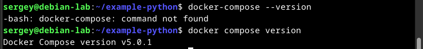

---

## Задача 1
1. Сделайте в своем GitHub пространстве fork [репозитория](https://github.com/netology-code/shvirtd-example-python).

2. Создайте файл ```Dockerfile.python``` на основе существующего `Dockerfile`:
   - Используйте базовый образ ```python:3.12-slim```
   - Обязательно используйте конструкцию ```COPY . .``` в Dockerfile
   - Создайте `.dockerignore` файл для исключения ненужных файлов
   - Используйте ```CMD ["uvicorn", "main:app", "--host", "0.0.0.0", "--port", "5000"]``` для запуска
   - Протестируйте корректность сборки
  2.1 Используйте multistage сборку вместо single stage.
3. (Необязательная часть, *) Изучите инструкцию в проекте и запустите web-приложение без использования docker, с помощью venv. (Mysql БД можно запустить в docker run).
4. (Необязательная часть, *) Изучите код приложения и добавьте управление названием таблицы через ENV переменную.

---

## Решение

1. Создал fork

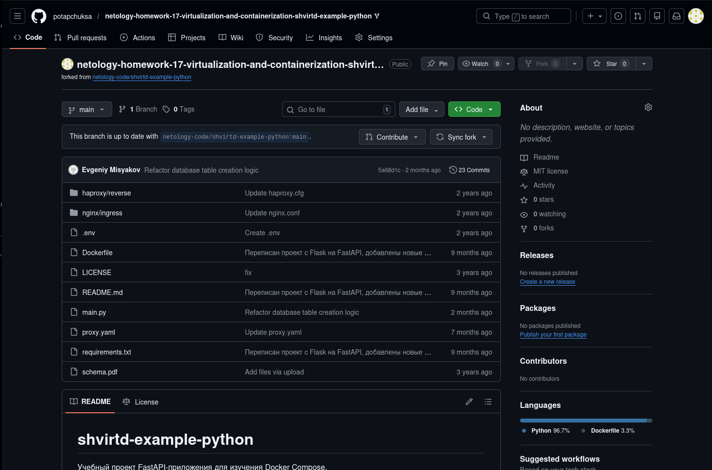

2. `Dockerfile.python`

```Dockerfile
FROM python:3.12-slim as builder

WORKDIR /app

RUN apt-get update \
    && apt-get install -y --no-install-recommends \
    gcc \
    python3-dev \
    && rm -rf /var/lib/apt/lists/*

COPY requirements.txt .
RUN pip install --no-cache-dir --prefix=/install -r requirements.txt


FROM python:3.12-slim

WORKDIR /app

COPY --from=builder /install /usr/local

COPY . .

RUN useradd -m -u 1000 appuser && chown -R appuser:appuser /app
USER appuser

EXPOSE 5000

CMD ["uvicorn", "main:app", "--host", "0.0.0.0", "--port", "5000"]
```

```bash
docker build -f Dockerfile.python -t shvirtd-web:1.0 .
```

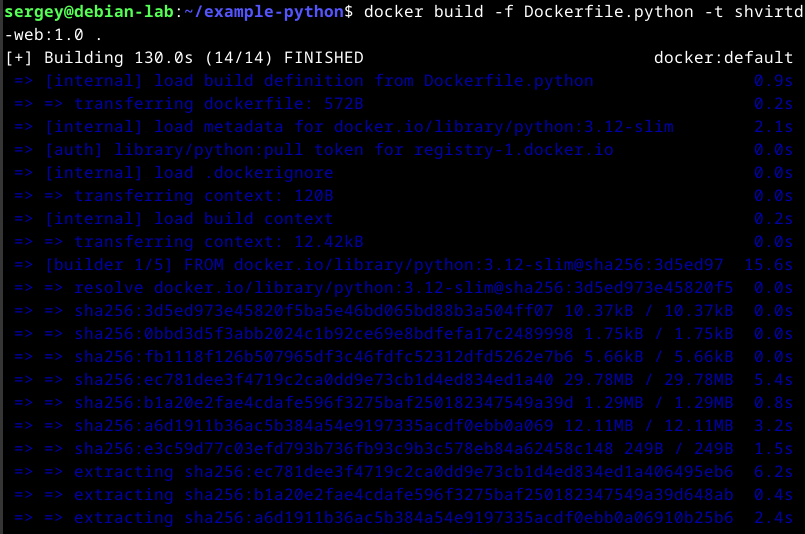

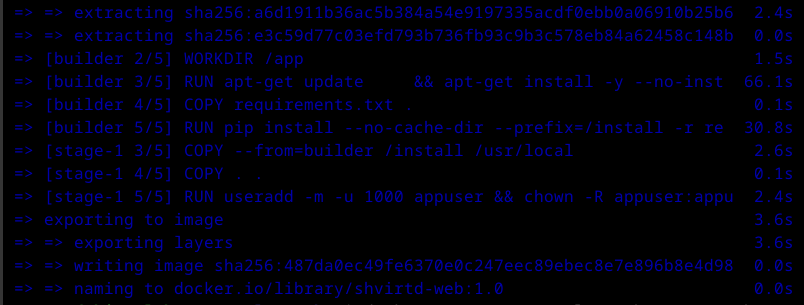

```bash
docker run --rm shvirtd-web:1.0 python -c "import fastapi, uvicorn, mysql.connector; print('Все пакеты на месте')"
```

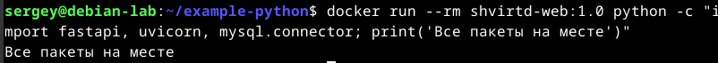

3. Запуск без использования Docker

```bash
export MYSQL_ROOT_PASSWORD="root_password"

docker run -d \
  --name mysql-local \
  -p 3306:3306 \
  -e MYSQL_ROOT_PASSWORD \
  mysql:8.0.27
```

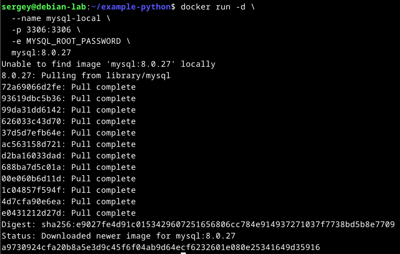

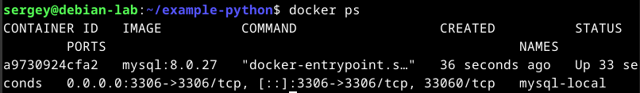

```bash
docker exec -it mysql-local mysql -uroot -p$MYSQL_ROOT_PASSWORD
```

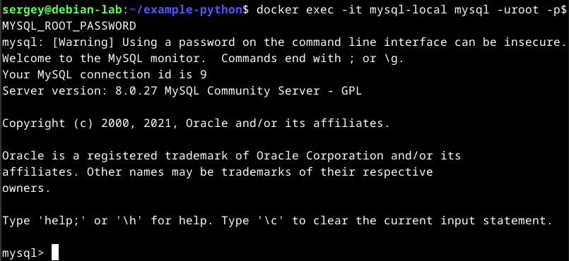

Настраиваем немного по-другому, чем описано в README (разрешаем подключение с 172.17.0.1 для docker-сети)

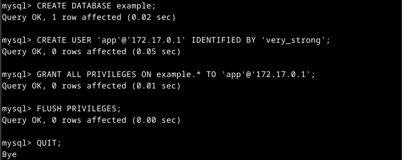

Запускаем как описано в README

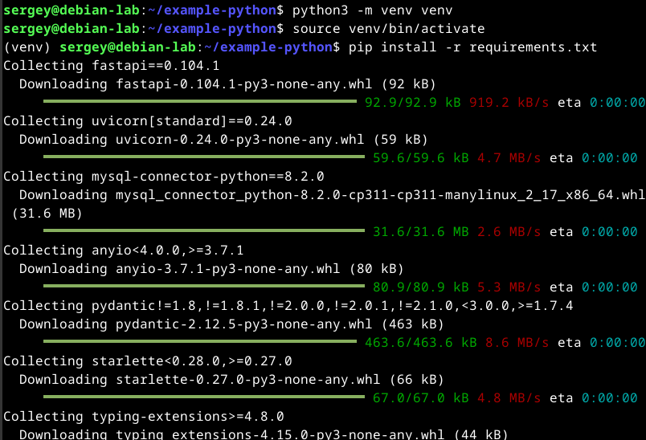

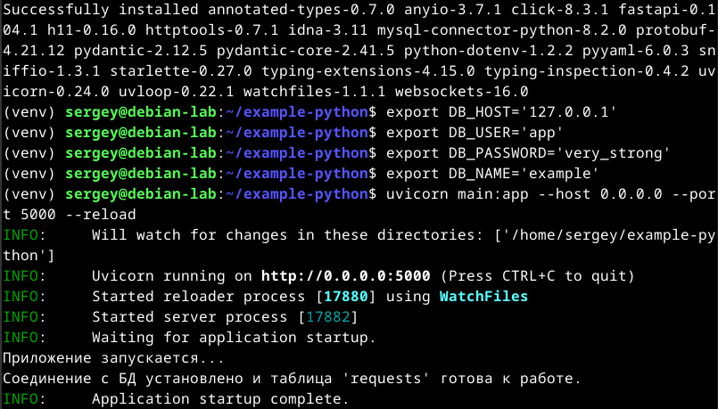

В другом терминале тестируем

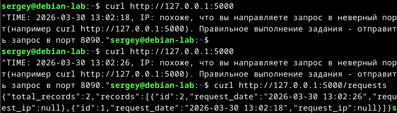

Сообщение возникает потому, что запрос отправляется напрямую, а не через прокси. В логах все Ok.

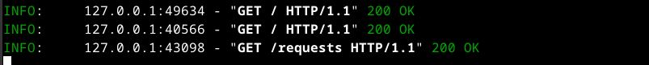

И в базу всё записывается правильно.

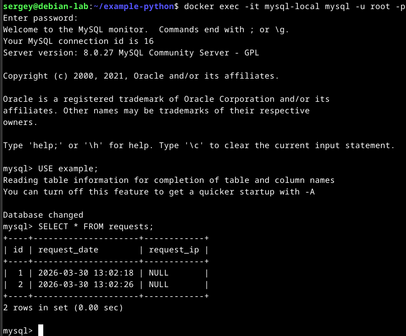

---

### ВНИМАНИЕ!
!!! В процессе последующего выполнения ДЗ НЕ изменяйте содержимое файлов в fork-репозитории! Ваша задача ДОБАВИТЬ 5 файлов: ```Dockerfile.python```, ```compose.yaml```, ```.gitignore```, ```.dockerignore```,```bash-скрипт```. Если вам понадобилось внести иные изменения в проект - вы что-то делаете неверно!

---

## Задача 2 (*)
1. Создайте в yandex cloud container registry с именем "test" с помощью "yc tool" . [Инструкция](https://cloud.yandex.ru/ru/docs/container-registry/quickstart/?from=int-console-help)
2. Настройте аутентификацию вашего локального docker в yandex container registry.
3. Соберите и залейте в него образ с python приложением из задания №1.
4. Просканируйте образ на уязвимости.
5. В качестве ответа приложите отчет сканирования.

---

## Решение

Делал по документации Яндекса

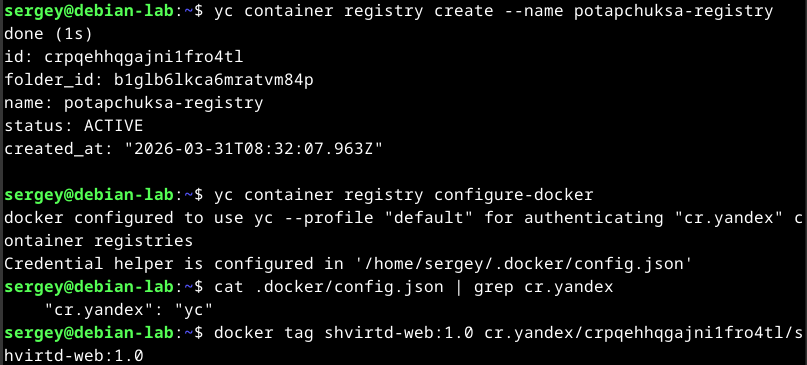

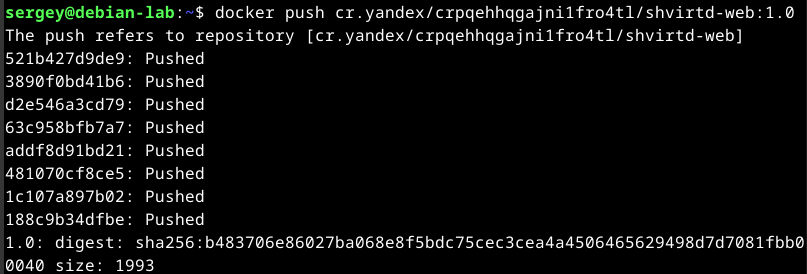


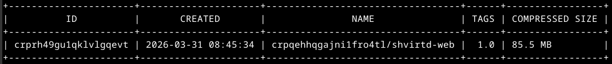

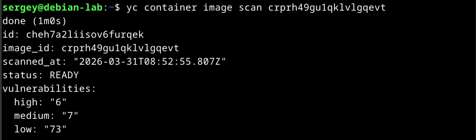

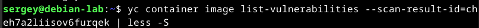

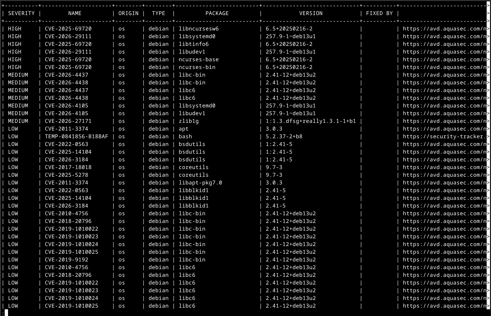

---

## Задача 3
1. Изучите файл "proxy.yaml"
2. Создайте в репозитории с проектом файл ```compose.yaml```. С помощью директивы "include" подключите к нему файл "proxy.yaml".
3. Опишите в файле ```compose.yaml``` следующие сервисы: 

- ```web```. Образ приложения должен ИЛИ собираться при запуске compose из файла ```Dockerfile.python``` ИЛИ скачиваться из yandex cloud container registry(из задание №2 со *). Контейнер должен работать в bridge-сети с названием ```backend``` и иметь фиксированный ipv4-адрес ```172.20.0.5```. Сервис должен всегда перезапускаться в случае ошибок.
Передайте необходимые ENV-переменные для подключения к Mysql базе данных по сетевому имени сервиса ```web``` 

- ```db```. image=mysql:8. Контейнер должен работать в bridge-сети с названием ```backend``` и иметь фиксированный ipv4-адрес ```172.20.0.10```. Явно перезапуск сервиса в случае ошибок. Передайте необходимые ENV-переменные для создания: пароля root пользователя, создания базы данных, пользователя и пароля для web-приложения.Обязательно используйте уже существующий .env file для назначения секретных ENV-переменных!

2. Запустите проект локально с помощью docker compose , добейтесь его стабильной работы: команда ```curl -L http://127.0.0.1:8090``` должна возвращать в качестве ответа время и локальный IP-адрес. Если сервисы не стартуют воспользуйтесь командами: ```docker ps -a ``` и ```docker logs <container_name>``` . Если вместо IP-адреса вы получаете информационную ошибку --убедитесь, что вы шлете запрос на порт ```8090```, а не 5000.

5. Подключитесь к БД mysql с помощью команды ```docker exec -ti <имя_контейнера> mysql -uroot -p<пароль root-пользователя>```(обратите внимание что между ключем -u и логином root нет пробела. это важно!!! тоже самое с паролем) . Введите последовательно команды (не забываем в конце символ ; ): ```show databases; use <имя вашей базы данных(по-умолчанию virtd, как это указано в .env)>; show tables; SELECT * from requests LIMIT 10;```. Примечание: таблица в БД создается после первого поступившего запроса к приложению.

6. Остановите проект. В качестве ответа приложите скриншот sql-запроса.

---

## Решение

```YAML
include:
  - proxy.yaml

services:
  web:
    build:
      context: .
      dockerfile: Dockerfile.python
    container_name: web_python
    environment:
      - DB_HOST=db
      - DB_PORT=3306
      - DB_NAME=${MYSQL_DATABASE}
      - DB_USER=${MYSQL_USER}
      - DB_PASSWORD=${MYSQL_PASSWORD}
    networks:
      backend:
        ipv4_address: 172.20.0.5
    depends_on:
      - db
    restart: unless-stopped

  db:
    image: mysql:8.0.27
    container_name: db_mysql
    environment:
      - MYSQL_ROOT_PASSWORD=${MYSQL_ROOT_PASSWORD}
      - MYSQL_DATABASE=${MYSQL_DATABASE}
      - MYSQL_USER=${MYSQL_USER}
      - MYSQL_PASSWORD=${MYSQL_PASSWORD}
    volumes:
      - mysql-data:/var/lib/mysql
    networks:
      backend:
        ipv4_address: 172.20.0.10
    restart: unless-stopped

networks:
  backend:
    driver: bridge
    ipam:
      config:
        - subnet: 172.20.0.0/24

volumes:
  mysql-data:
```

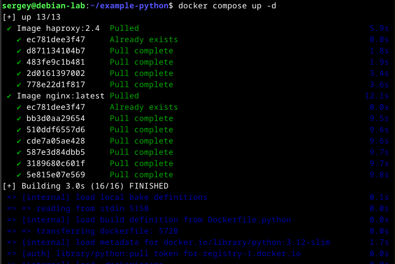

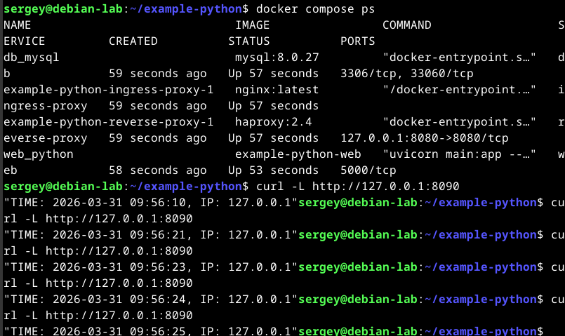

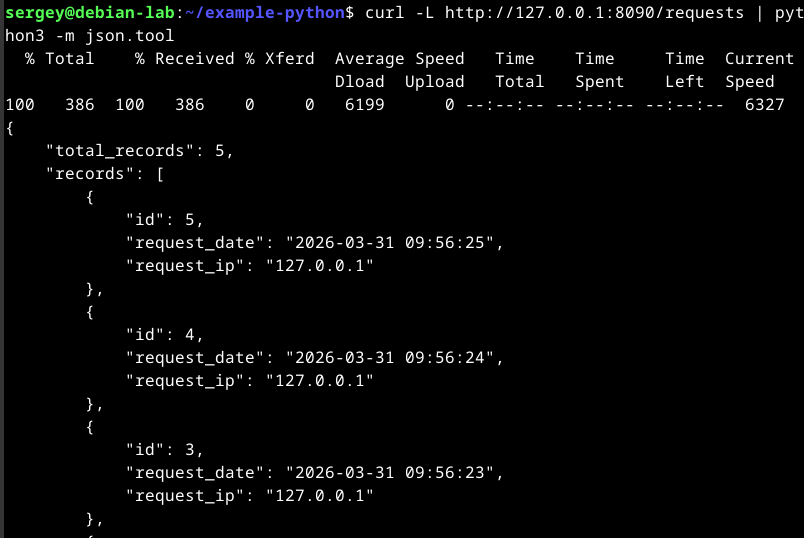

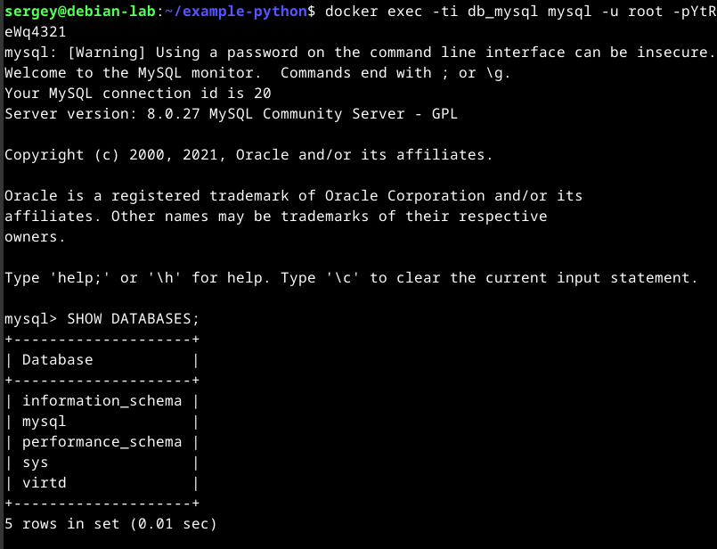

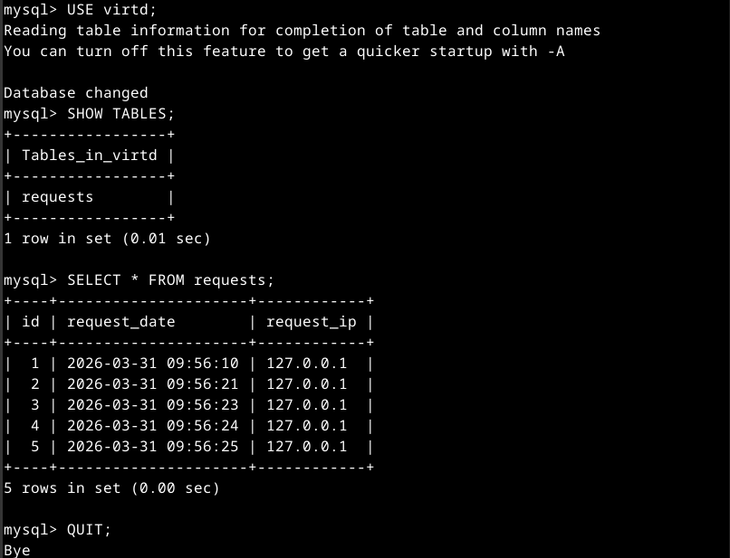

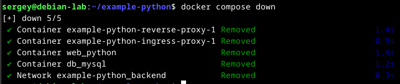

---

## Задача 4
1. Запустите в Yandex Cloud ВМ (вам хватит 2 Гб Ram).
2. Подключитесь к Вм по ssh и установите docker.
3. Напишите bash-скрипт, который скачает ваш fork-репозиторий в каталог /opt и запустит проект целиком.
4. Зайдите на сайт проверки http подключений, например(или аналогичный): ```https://check-host.net/check-http``` и запустите проверку вашего сервиса ```http://<внешний_IP-адрес_вашей_ВМ>:8090```. Таким образом трафик будет направлен в ingress-proxy. Трафик должен пройти через цепочки: Пользователь → Internet → Nginx → HAProxy → FastAPI(запись в БД) → HAProxy → Nginx → Internet → Пользователь
5. (Необязательная часть) Дополнительно настройте remote ssh context к вашему серверу. Отобразите список контекстов и результат удаленного выполнения ```docker ps -a```
6. Повторите SQL-запрос на сервере и приложите скриншот и ссылку на fork.

---

## Решение

```bash
yc vpc network create \
  --name shvirtd-network \
  --description "Network for shvirtd project"

yc vpc subnet create \
  --name shvirtd-subnet-a \
  --network-name shvirtd-network \
  --zone ru-central1-a \
  --range 10.0.0.0/24 \
  --description "Subnet for shvirtd in ru-central1-a"

yc compute instance create \
  --name shvirtd \
  --hostname shvirtd \
  --zone ru-central1-a \
  --platform standard-v3 \
  --cores 2 \
  --memory 2GB \
  --core-fraction 20 \
  --create-boot-disk type=network-hdd,size=10GB,image-family=ubuntu-2204-lts,image-folder-id=standard-images \
  --public-ip \
  --ssh-key ~/.ssh/id_rsa.pub \
  --metadata serial-port-enable=1 \
  --preemptible
```

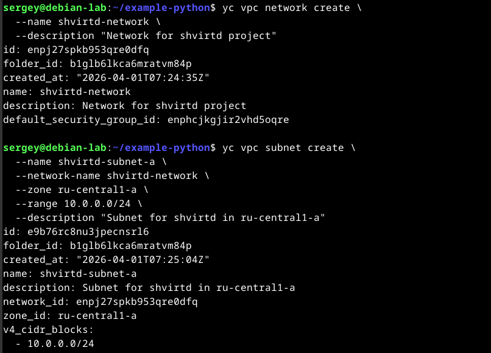

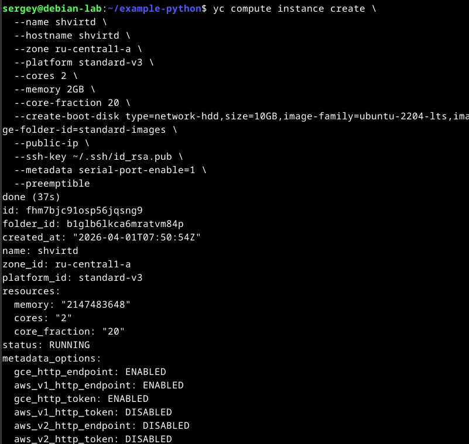

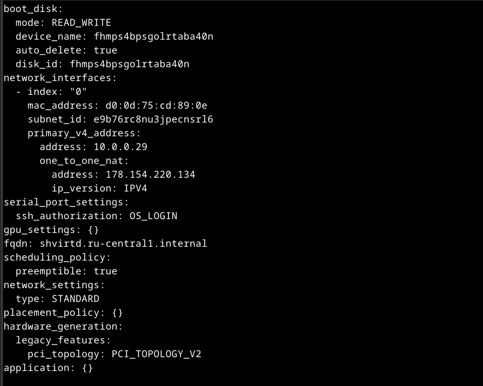

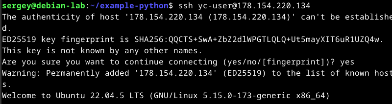

Установил Docker по документации с оффициального сайта.

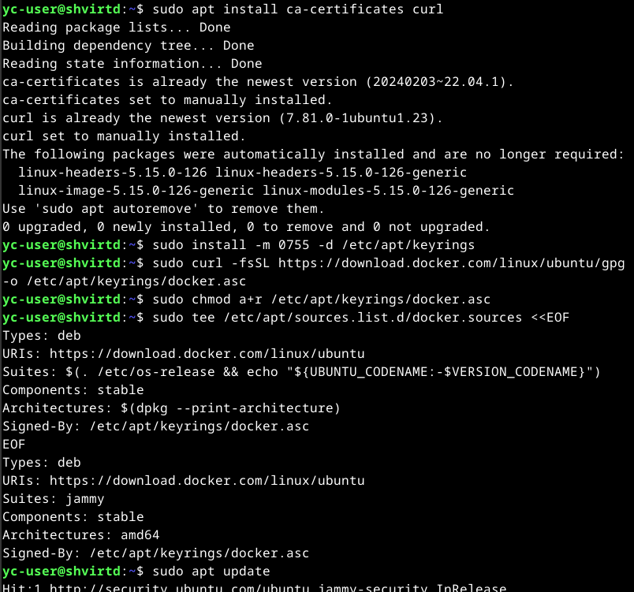

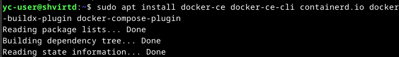

Скрипт для деплоя

```bash
#!/bin/bash
set -e

REPO_URL="https://github.com/potapchuksa/netology-homework-17-virtualization-and-containerization-shvirtd-example-python.git"
DEPLOY_DIR="/opt/shvirtd-example"

if [ -d "$DEPLOY_DIR" ]; then
    cd "$DEPLOY_DIR" && git pull
else
    sudo git clone "$REPO_URL" "$DEPLOY_DIR"
    sudo chown -R $USER:$USER "$DEPLOY_DIR"
    cd "$DEPLOY_DIR"
fi

[ ! -f ".env" ] && cat > .env << EOF
MYSQL_ROOT_PASSWORD=VeryStrongRoot123!
MYSQL_DATABASE=virtd
MYSQL_USER=app
MYSQL_PASSWORD=VeryStrongApp456!
EOF

docker compose down --remove-orphans 2>/dev/null || true
docker compose up -d --build
```
(Зря писал блок с созданием .env файла, но по-правильному его хранить нельзя, еще хотел рандомные пароли генерить)

Скопировал

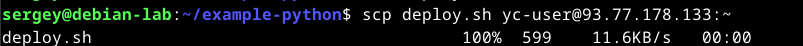

Запустил

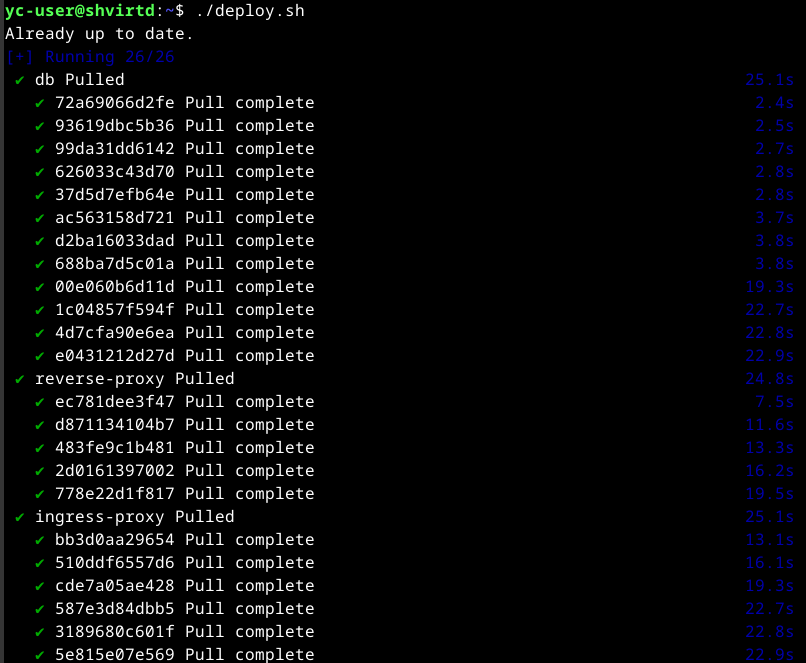

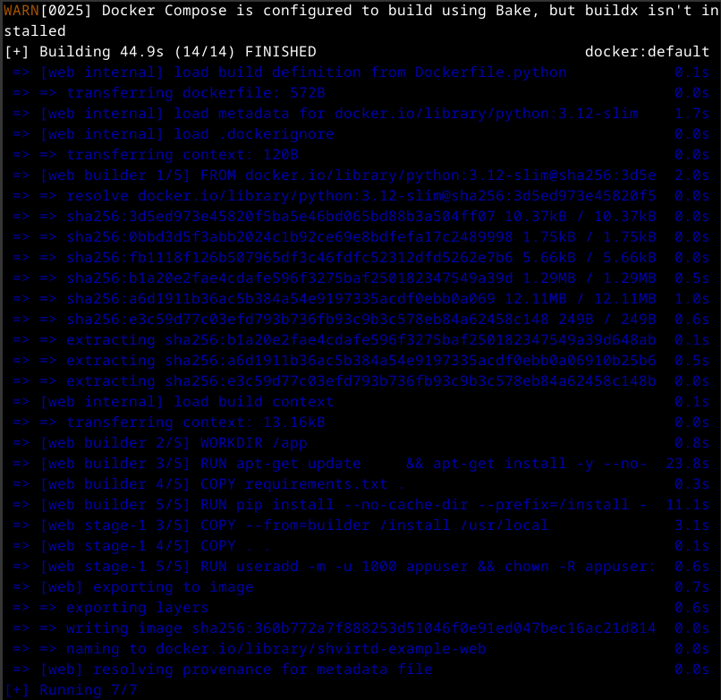

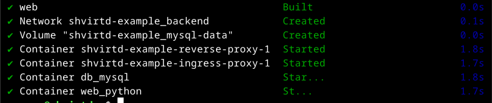

Протестировал

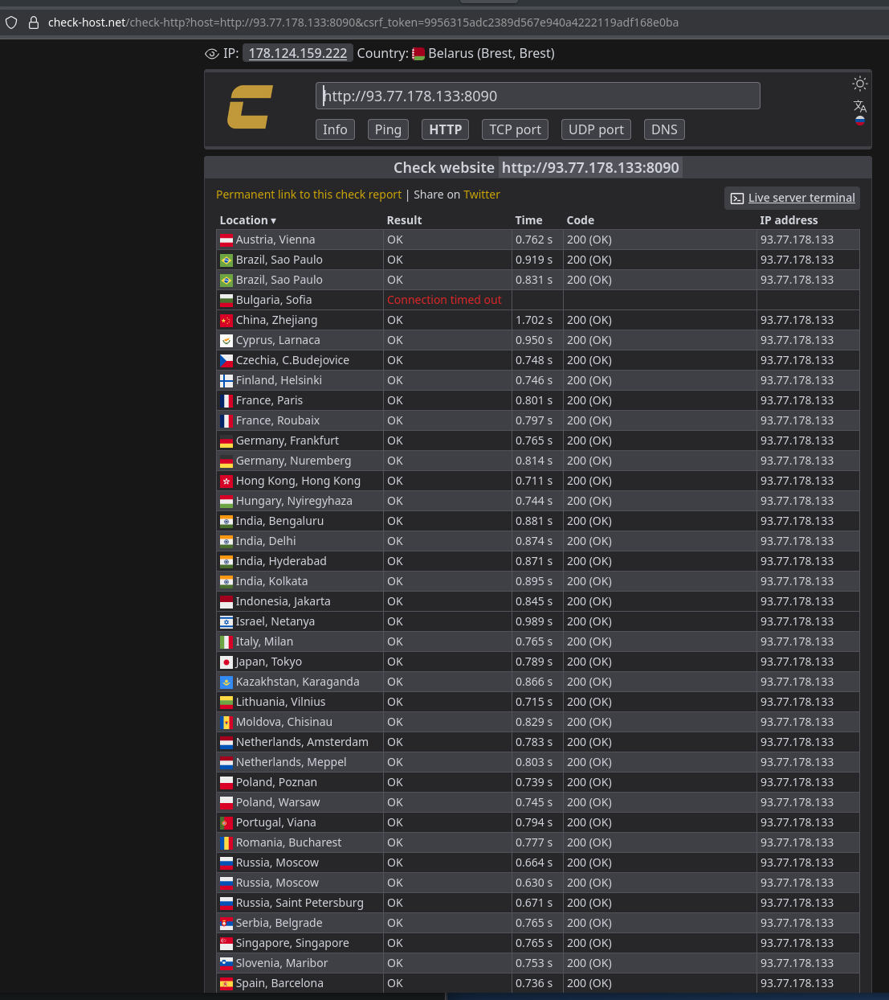

Проверил данные в requests

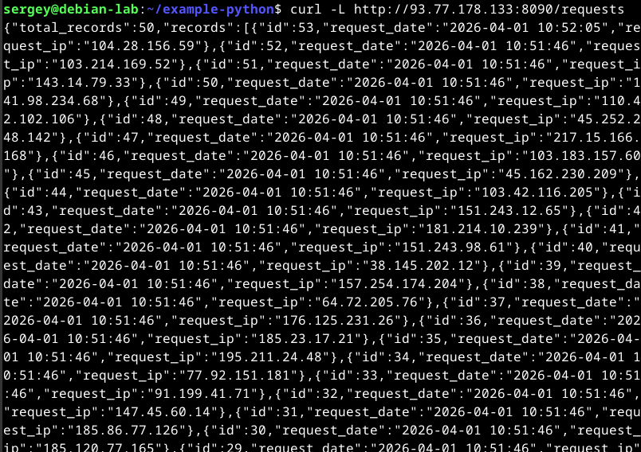

```bash
docker context create yc-remote --docker "host=ssh://yc-user@93.77.178.133"
docker context use yc-remote
docker info
```

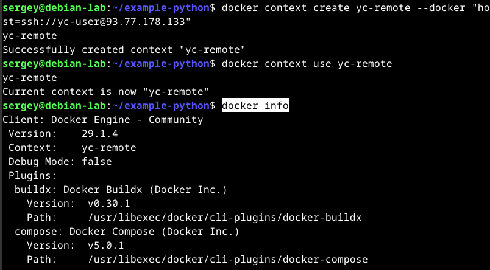

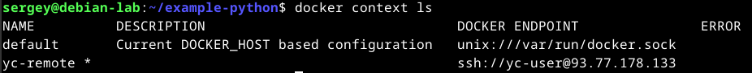

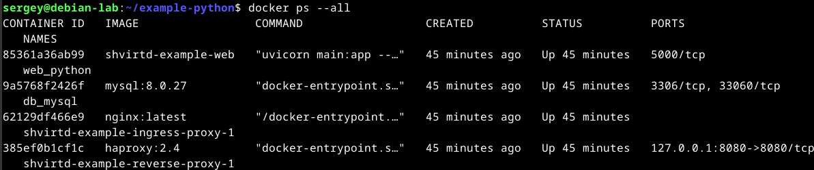

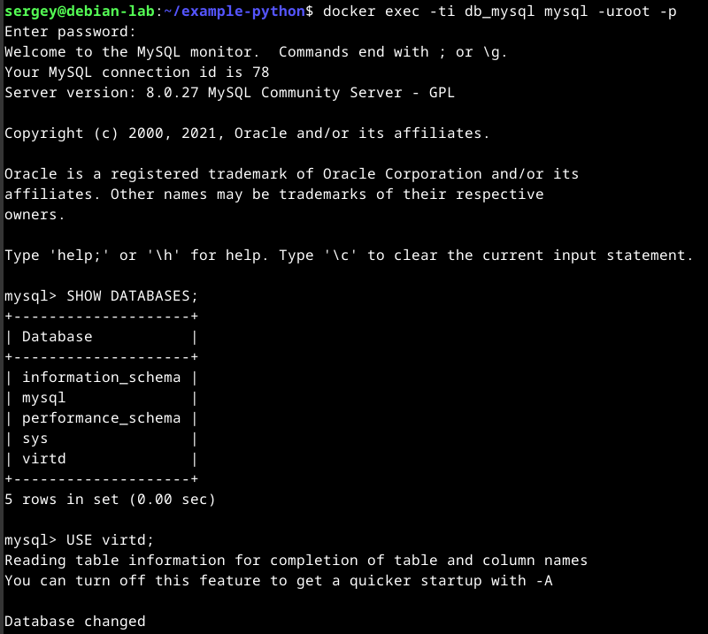

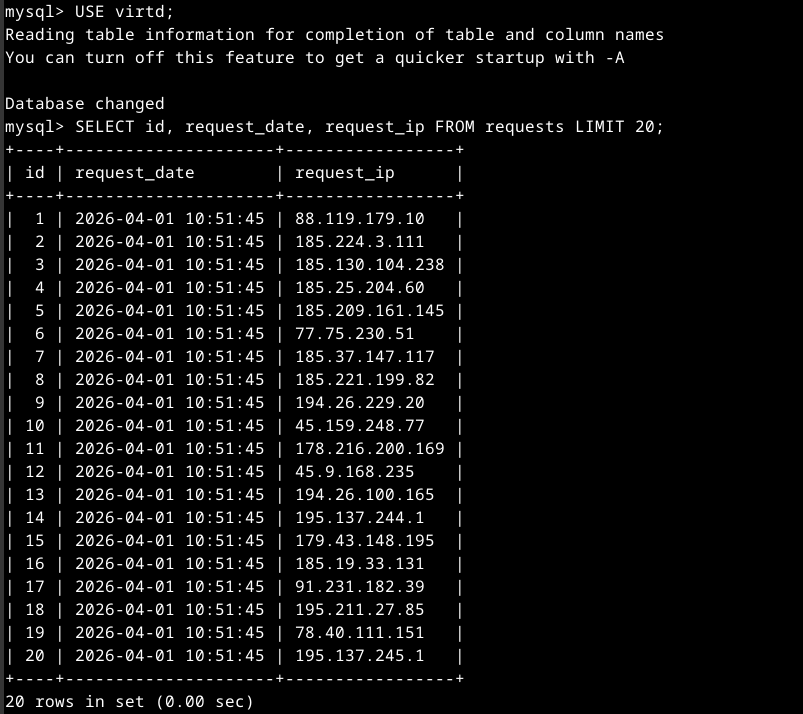

Вернулся на локальный

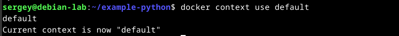

---

## Задача 5 (*)
1. Напишите и задеплойте на вашу облачную ВМ bash скрипт, который произведет резервное копирование БД mysql в директорию "/opt/backup" с помощью запуска в сети "backend" контейнера из образа ```schnitzler/mysqldump``` при помощи ```docker run ...``` команды. Подсказка: "документация образа."
2. Протестируйте ручной запуск
3. Настройте выполнение скрипта раз в 1 минуту через cron, crontab или systemctl timer. Придумайте способ не светить логин/пароль в git!!
4. Предоставьте скрипт, cron-task и скриншот с несколькими резервными копиями в "/opt/backup"

---

## Решение

Файл `/opt/backup/bin/backup` (root:root 700)

```bash
#!/bin/sh
now=$(date +"%Y%m%d_%H%M%S")
/usr/bin/mysqldump --opt -h ${MYSQL_HOST} -u ${MYSQL_USER} -p${MYSQL_PASSWORD} ${MYSQL_DATABASE} > "/backup/${now}_${MYSQL_DATABASE}.sql"
ls -t /backup/*.sql 2>/dev/null | tail -n +11 | xargs -r rm
```

Файл `/opt/backup/bin/crontab` (root:root 600)

```
* * * * * /usr/local/bin/backup
```

Запускаем контейнер

```bash
sudo docker run -d \
  --name mysql-backup-cron \
  --restart unless-stopped \
  --network shvirtd-example_backend \
  -v /opt/backup:/backup \
  -v /opt/backup/bin/backup:/usr/local/bin/backup \
  -v /opt/backup/bin/crontab:/var/spool/cron/crontabs/root \
  -e MYSQL_HOST=db_mysql \
  -e MYSQL_USER=app \
  -e MYSQL_PASSWORD=QwErTy1234 \
  -e MYSQL_DATABASE=virtd \
  schnitzler/mysqldump
```

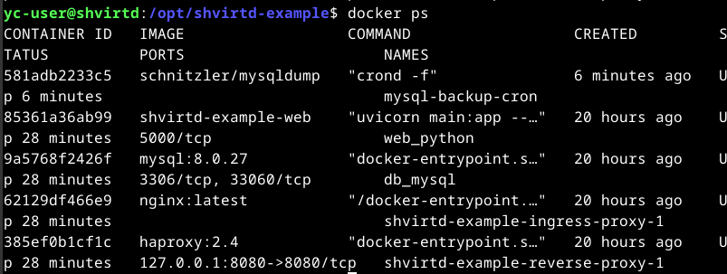

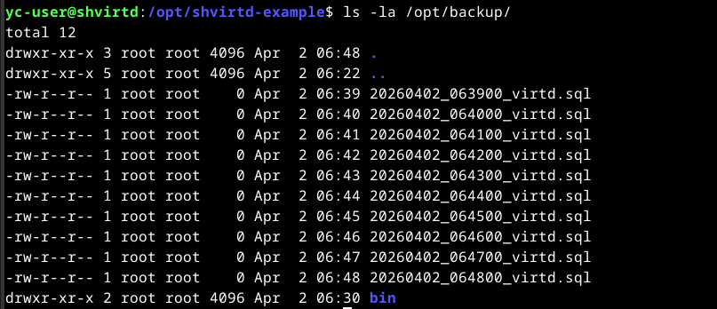

---

## Задача 6
Скачайте docker образ ```hashicorp/terraform:latest``` и скопируйте бинарный файл ```/bin/terraform``` на свою локальную машину, используя dive и docker save.
Предоставьте скриншоты  действий .

---

## Решение

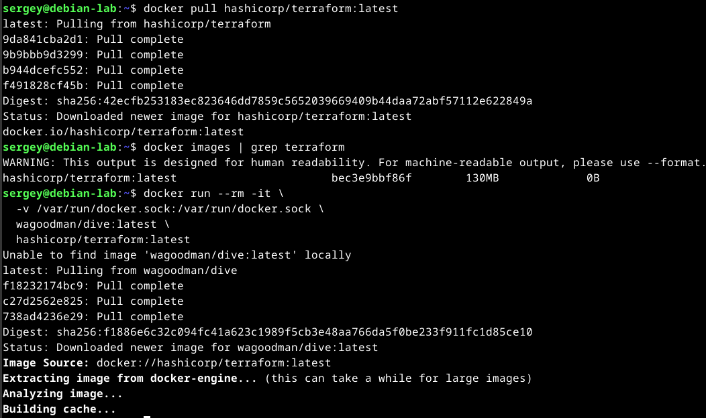

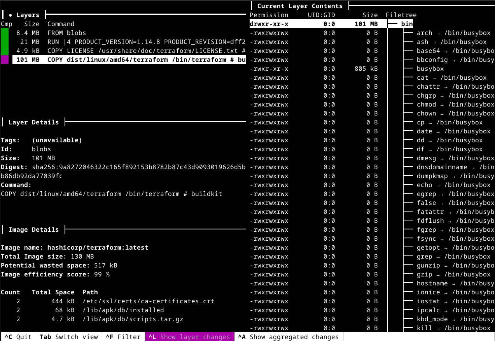

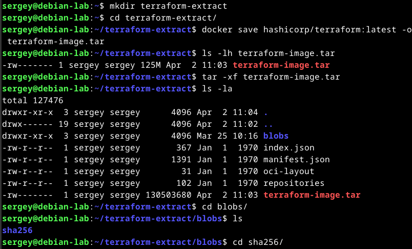

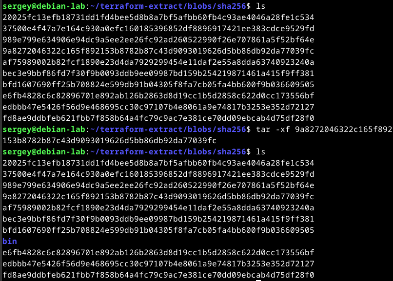


---

## Задача 6.1
Добейтесь аналогичного результата, используя docker cp.  
Предоставьте скриншоты  действий .

---

## Решение


---

## Задача 6.2 (**)
Предложите способ извлечь файл из контейнера, используя только команду docker build и любой Dockerfile.  
Предоставьте скриншоты  действий .

---

## Решение


---

## Задача 7 (***)
Запустите ваше python-приложение с помощью runC, не используя docker или containerd.  
Предоставьте скриншоты  действий .

---
